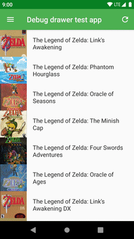
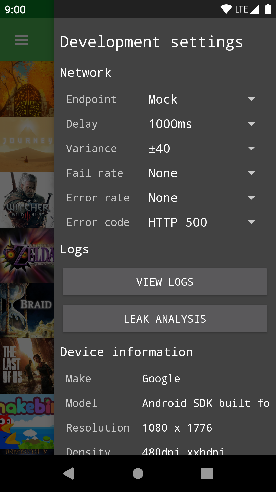

DebugDrawer
===========



A configurable debug drawer to use in your Android app. Inspired by
[u2020](https://github.com/JakeWharton/u2020).

The debug drawer is something you can add to your debug builds to make your life easier as a
developer or tester. It provides a convenient way of exposing development specific controls without
cluttering up your user interface. There are quite a few possibilities this opens up, such as adding
shortcuts, displaying diagnostic information, or anything you might want.

To give you some inspiration, this repository provides out of the box modules for:
 - Configuring [Retrofit](https://square.github.io/retrofit/) endpoints and mock network behaviour
 - Displaying device information
 - Viewing and sharing Logcat entries collected by [Timber](https://github.com/JakeWharton/timber)
 - Providing a more convenient entry into [LeakCanary](https://github.com/square/leakcanary)
 - Selecting a logging level and piping OkHttp logs into Timber
 
Of course, you're free to implement your own modules as well.
 
Usage
-----

This library assumes that for a given `Activity` you will populate one to many `ViewGroups` inside
of it over its lifetime. Instead of calling `setContentView()` directly, define a function in both
your debug and release builds to get the root `ViewGroup` that `Activity` should use to present a
screen. This would look something like...

**Debug**
```kotlin
fun getRootContainerFor(activity: Activity): ViewGroup {
  return DebugDrawer.with(activity)
      .addSectionTitle("Device information")
      .addModule(DeviceInfoModule())
      // ...and whatever other modules you want to add.
      .buildMainContainer()
}
```
**Release**
```kotlin
fun getRootContainerFor(activity: Activity): ViewGroup {
  return activity.findViewById(android.R.id.content) as ViewGroup
}
```

You can then use this `ViewGroup` to populate your `Activity`'s view, or use it as the container
when push/popping `Fragments` or `Controllers` or whatever you fancy. For your debug builds this
container will be inside of a
[`DrawerLayout`](https://developer.android.com/reference/androidx/drawerlayout/widget/DrawerLayout),
allowing you to swipe from the "end" edge of your screen to get access to debug settings. For
release builds you'll be pushing views into the root container as normal.

### Making new modules

You have two options if you want to add custom modules to your drawer. You can implement
[`DebugDrawerModule`](https://github.com/Gridstone/DebugDrawer/blob/master/debugdrawer/src/main/kotlin/au/com/gridstone/debugdrawer/DebugDrawerModule.kt),
or you can extend
[`KeyValueDebugDrawerModule`](https://github.com/Gridstone/DebugDrawer/blob/master/debugdrawer/src/main/kotlin/au/com/gridstone/debugdrawer/KeyValueDebugDrawerModule.kt).
The latter is useful if all you want to do is display some key value pairs. The former allows you to
return whatever `View` you want. It also provides optional lifecycle callbacks if your module needs
to bind and unbind to expensive resources.

The `debugdrawer` dependency has a few publicly exported style resources. You can use these styles
(such as `Widget.DebugDrawer.RowTitle`) to ensure your custom module maintains a consistent
appearance with other modules in the drawer. Yes, this is a development tool, but developers can
appreciate nice UIs too!

Why another implementation?
---------------------------

It's true; there are a few other implementations of a reusable debug drawer out there. This project
aims to have a simpler API, especially when it comes to creating custom modules. Also having the
library written in Kotlin makes it more enjoyable to work on 😄.

Sample apps
-----------



This repository provides two sample apps that demonstrate usage of the debug drawer. The
`simple-sample-app` has no other dependencies and is about as bare-bones as you can get. The
`sample-app` is a bit more complex. It interfaces with the
[Giant Bomb API](https://www.giantbomb.com/api/) to retrieve and display a list of video games, and
aims to be closer to a real application.

Browsing through the implementation of `sample-app` should provide you with an idea of how you could
add the debug drawer to your app. You might want to use dependency injection to assist in setting it
up, or you could follow the example and try and roll something by hand. Whatever your choice, it
doesn't need to be particularly complex.

Provided modules
----------------

### LeakCanary

LeakCanary is a fantastic tool for detecting memory leaks in your app. The only problem with it is
how it adds a launcher icon for each app you have installed that uses it. This module takes care of
removing that launcher icon and cages LeakCanary in the debug drawer.

The only requirement for using this module is that you're calling
```kotlin
override fun onCreate() {
  LeakCanary.install(this)
}
```
in your `Application` class as per LeakCanary's documentation.

### Timber

Timber provides some nice utility on top of Android's standard `Log` class. This modules aims to
enhance it further by providing a mechanism to view logs from within your own app. In addition, it
allows you to share the current collection of logs if you happen to see something interesting.

### OkHttp logger

It can be incredibly useful to view HTTP requests and results when debugging your app. This module
provides a dropdown menu in the drawer to select what level of logging you'd like to see for your
HTTP requests. It relies on you using OkHttp as your HTTP client, and pipes its output into Timber.

To use it, first add
[HttpLogger.interceptor](https://github.com/Gridstone/DebugDrawer/blob/master/debugdrawer-okhttp-logger/src/main/kotlin/au/com/gridstone/debugdrawer/HttpLogger.kt)
as an interceptor to your `OkHttpClient`. Then pass `HttpLogger` on to
[OkHttpLoggerModule](https://github.com/Gridstone/DebugDrawer/blob/master/debugdrawer-okhttp-logger/src/main/kotlin/au/com/gridstone/debugdrawer/OkHttpLoggerModule.kt).

### Device info

Nothing too fancy, this module displays
 - Manufacturer
 - Model
 - Screen resolution
 - Screen density
 - Current API version
 
### Retrofit

This is one of the more complicated modules. Retrofit is a great tool for abstracting RESTful APIs,
and often you might want to configure its behaviour. This is useful if you make use of
[retrofit-mock](https://github.com/square/retrofit/tree/master/retrofit-mock) and want to modify
`NetworkBehavior` at runtime, or maybe your debug app can target one of many different environments,
such as development, staging, or production.

To begin, you must create a list of
[`Endpoints`](https://github.com/Gridstone/DebugDrawer/blob/master/debugdrawer-retrofit/src/main/kotlin/au/com/gridstone/debugdrawer/Endpoint.kt).
This list might include entries such as `staging`, or `mock`.

Next, create an instance of
[`DebugRetrofitConfig`](https://github.com/Gridstone/DebugDrawer/blob/master/debugdrawer-retrofit/src/main/kotlin/au/com/gridstone/debugdrawer/DebugRetrofitConfig.kt).
This class takes care of persisting settings between app launches, and forwarding any runtime
modifications to `NetworkBehavior`. It also ensures that when you select a new `Endpoint` your
entire app process is restarted.

Finally, you can add
[`RetrofitModule`](https://github.com/Gridstone/DebugDrawer/blob/master/debugdrawer-retrofit/src/main/kotlin/au/com/gridstone/debugdrawer/RetrofitModule.kt)
to your debug drawer builder and it will take care of the rest. It might be easier to understand by
looking at an example, so check out `sample-app` to see it in action.

Download
--------

All artifacts are up on Maven Central.

For the main library
```
au.com.gridstone.debugdrawer:debugdrawer:0.9.6
```
For the LeakCanary module
```
au.com.gridstone.debugdrawer:debugdrawer-leakcanary:0.9.6
```
For the Retrofit module
```
au.com.gridstone.debugdrawer:debugdrawer-retrofit:0.9.6
```
For the Timber module
```
au.com.gridstone.debugdrawer:debugdrawer-timber:0.9.6
```
For the OkHttp logger
```
au.com.gridstone.debugdrawer:debugdrawer-okhttp-logger:0.9.6
```

Contributing
------------

Pull requests are welcome, but we do want to keep this codebase fairly lean. Consider how much
utility a new drawer module would provide to all Android developers. If it's usage is niche then it
might be better maintained as a separate project. Feel free to open issues to discuss new module
ideas.

When submitting code, please adhere to Gridstone's
[Kotlin style guide](https://github.com/Gridstone/KotlinStyleGuide).

Licence
-------

    Copyright 2018 GRIDSTONE

    Licensed under the Apache License, Version 2.0 (the "License");
    you may not use this file except in compliance with the License.
    You may obtain a copy of the License at

       http://www.apache.org/licenses/LICENSE-2.0

    Unless required by applicable law or agreed to in writing, software
    distributed under the License is distributed on an "AS IS" BASIS,
    WITHOUT WARRANTIES OR CONDITIONS OF ANY KIND, either express or implied.
    See the License for the specific language governing permissions and
    limitations under the License.
